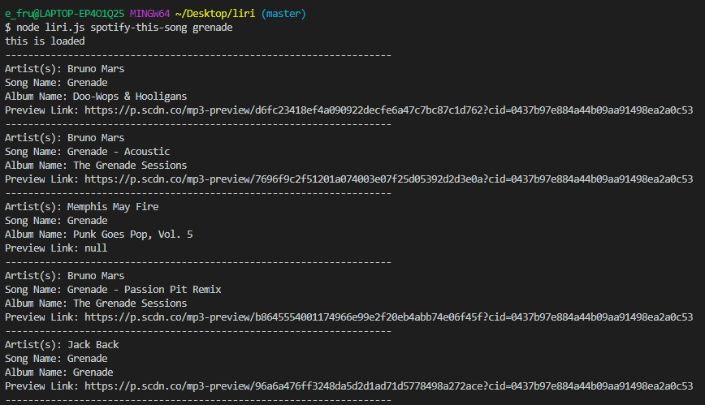
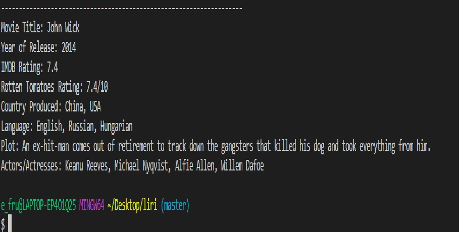
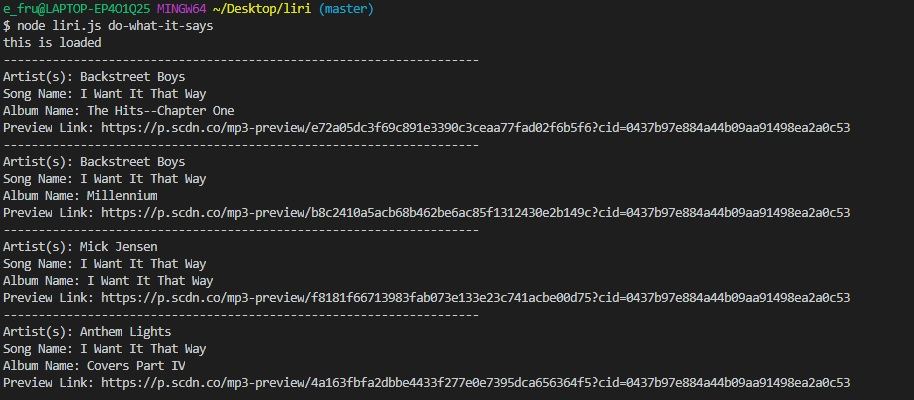
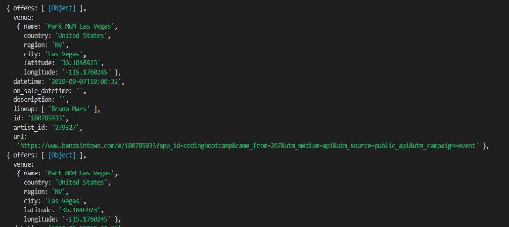

# liri-node app.

This app uses axios to retrieve data from Bands in Town, OMDB and Spotify. LIRI is a command line node app that will takes parameters and gives you back data. This app will search song in spotity using "spotify-this-song", will search movies in OMDB using "movie-this", will look for a concert events of an artist using "concert-this", and will search random stuff using the key words "do-what-it-says, and it will append your file in txt using appendFile and store that data in my random.txt file.

*spotify-this-song,
to make this command works, just type "spotify-this-song + the song you want to search", and it will give different artist who have the same
  song title and the details of the song.

This is the image of my working app for "spotify-this-song" this one retrieve data from spoitfy.

*movie-this,
to make this command works, just type "movie-this + the movie you want to search", and it will give you all the details about the movie including ratings, year, language etc.

This is the image of my working app for "movie-this" this one retrieve data from OMDB.

*do-what-it-says,
to make this command works, just type "do-what-it-says", and it will search random stuff like, artist name, album etc.

This is the image of my working app for "do-what-it-says" this one retrieve data from all the apis that i'm working in this app.

*concert-this,
to make this command works, just type "concert-this + the artist you want to search", and it will give you all the details about the artist gig dates, including places, time, venues etc.

This is the image of my working app for "concert-this" this one retrieve data from bands and town and give you all the information regarding the bands gigs in different places of the country.

